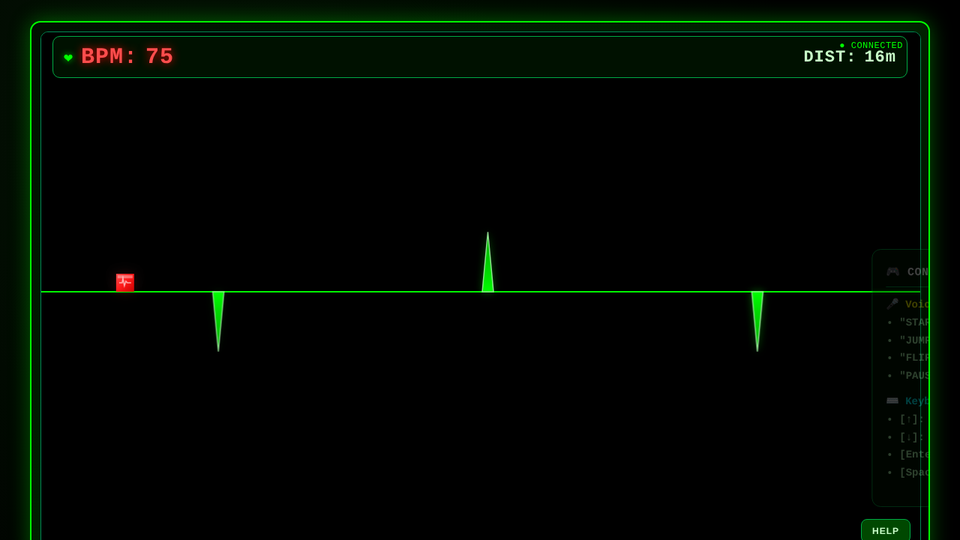
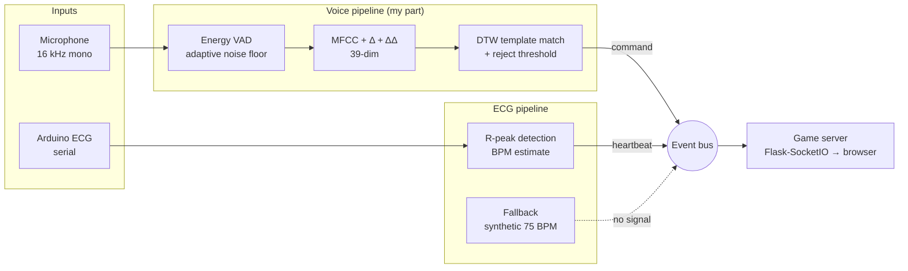
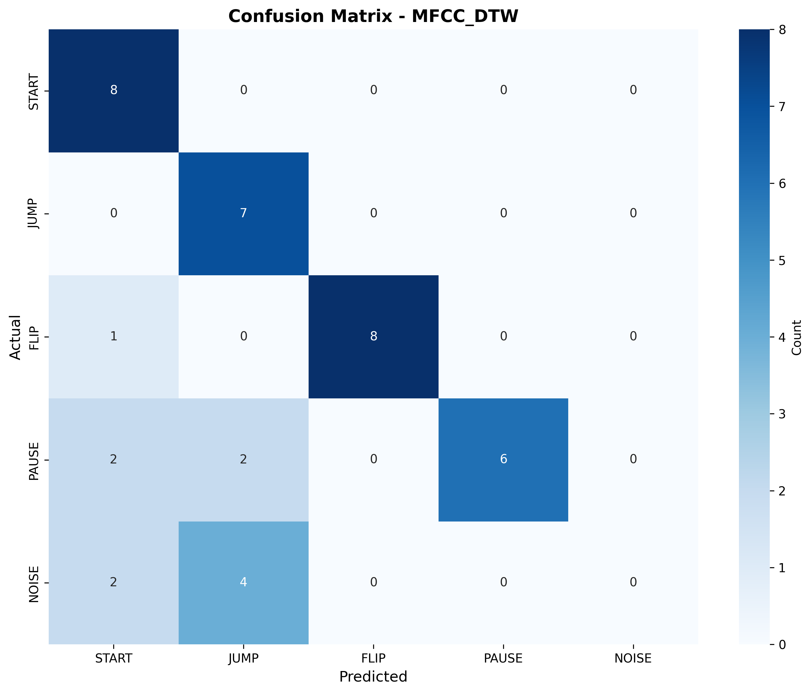

# ECG Pulse Runner — Voice- and Heartbeat-Controlled Game


A side-scrolling runner where **your heartbeat builds the level and your voice plays it**. An Arduino ECG front end turns each detected R-peak into an obstacle; a training-free speech recognizer listens for four spoken commands (`START`, `JUMP`, `FLIP`, `PAUSE`) and drives the player in real time.

Final project for the **Digital Signal Processing Laboratory** at National Tsing Hua University (Fall 2025), built by a team of three. **My part was the voice-command recognition pipeline**: segmentation, feature extraction, template matching, and the benchmark that chose between four matching strategies.

<p align="center">
  
  <br><sub>Gameplay in ECG-fallback mode (simulated 75 BPM signal). Spikes above and below the baseline are heartbeats.</sub>
</p>

## Highlights

- **Training-free recognizer.** Energy-based VAD → 39-dimensional MFCC (13 + Δ + ΔΔ) → DTW against a handful of recorded templates per command. No model training, so a new player can recalibrate in seconds.
- **Measured trade-off, not just a best number.** Four matching strategies were benchmarked under time-stretch, pitch-shift and additive-noise augmentation. The adaptive ensemble was the most accurate (97.9%), but the game ships with MFCC-DTW because it answers about 100 ms sooner, which matters for a `JUMP`.
- **Live-microphone validation.** 85.3% command accuracy (29/34) in a live test with a speaker outside the template set.
- **Graceful hardware fallback.** If the ECG board is missing or the signal drops for 5 s, the game switches to a synthetic heartbeat and keeps retrying the real sensor.

## System overview



| Module | Path | Role |
|--------|------|------|
| Voice | [`src/audio/`](src/audio) | `vad.py` segmentation, `features.py` MFCC/Mel/LPC/RASTA-PLP, `recognizers.py` matchers and ensembles, `controller.py` real-time loop and calibration |
| ECG | [`src/ecg/`](src/ecg) | Serial reader, R-peak detection, real/synthetic signal switching |
| Game | [`src/game/`](src/game) | Flask-SocketIO server and browser canvas game |
| Glue | [`src/event_bus.py`](src/event_bus.py), [`app.py`](app.py) | Decoupled publish/subscribe between modules; CLI entry point |

## Voice recognition: how it works

1. **Capture and segment.** Audio arrives in 256-sample (16 ms) chunks. The VAD tracks the background RMS and opens a segment when energy rises above 1.6× / 3.5× that floor, closing it after 80 ms of silence (120–1500 ms utterances accepted).
2. **Features.** 13 MFCCs plus first- and second-order deltas give a 39-dimensional frame vector (`n_fft = 1024`, 80–7600 Hz).
3. **Match.** Each segment is compared to every command template with DTW; the best match wins only if its distance is under a rejection threshold, so out-of-vocabulary speech is ignored.
4. **Calibrate (optional).** Before each game the player can record one take of each command. These are added as session-only templates, which helps unfamiliar voices without touching the shared template set. A "freedom mode" lets the player use any word as a command.

## Results

### Strategy benchmark (offline arena)

Recorded templates replayed with time-stretch, pitch-shift and additive-noise augmentation. Latency is recognizer compute time per utterance.

| Strategy | Overall accuracy | 10 dB SNR accuracy | Avg. latency |
|----------|-----------------:|-------------------:|-------------:|
| **MFCC-DTW (shipped)** | 94.3% | 64% | **~165 ms** |
| Fixed-weight ensemble (MFCC + Mel + LPC) | 94.6% | 71% | ~220 ms |
| Adaptive ensemble (SNR-weighted, spectral subtraction) | **97.9%** | **93%** | ~270 ms |
| RASTA-PLP | 88.5% | 68% | ~195 ms |

The adaptive ensemble is clearly more robust in noise, but at roughly 100 ms more per command it made jumps feel late. For a reaction game that latency mattered more than the noise margin, so MFCC-DTW became the default; the ensemble stays available via `--voice-method adaptive_ensemble`.

### Live-microphone test



- **Command accuracy: 85.3% (29/34)** with a speaker outside the template set.
- Most errors were `PAUSE` being read as `START` or `JUMP`.
- Recognizer latency averaged 203 ms (43–501 ms) in this run.
- **Known weakness:** none of the 6 pure-noise clips were rejected; all triggered a command. The rejection threshold was tuned loose to avoid missed jumps, which trades away false-positive control. A garbage/noise template class or an SNR gate is the obvious next step.

Full reports: [`docs/results/live_qa/`](docs/results/live_qa); rerun with `python scripts/test_QA_audio.py --method mfcc_dtw` (writes a new report and confusion matrix there). Experiment history: [`docs/EXPERIMENT_HISTORY.md`](docs/EXPERIMENT_HISTORY.md).

<br clear="right">

## Quick start

```bash
conda create -n dspfp python=3.10 -y && conda activate dspfp
pip install -r requirements.txt

python app.py                     # auto-detects the ECG board; falls back to a synthetic heartbeat
python app.py --no-ecg            # voice only
python app.py --freedom           # pick your own words for the four commands
python app.py --voice-method adaptive_ensemble
```

The game opens at <http://localhost:5000>. Keyboard controls also work: `Enter` start, `↑` jump, `↓` flip, `Space` pause.

## Repository layout

```
app.py                 entry point (CLI flags for ECG port, voice method, ports)
src/                   audio/, ecg/, game/, event_bus.py, config.py
cmd_templates/         default command templates (+ augmented variants)
cmd_templates_chinese/ Mandarin command templates
tests/                 pytest suites, arena benchmarks, QA scripts; tests/record/ holds their output
scripts/               live QA test, template augmentation, failure analysis, latency profiling; scripts/archive/ holds one-off dev scripts
record/                experiment logs written by the scripts
docs/                  architecture, experiment history, testing guide, results, dev notes
```

More documentation: [`docs/README.md`](docs/README.md) · [Chinese user guide](docs/user-guide.zh-TW.md)
